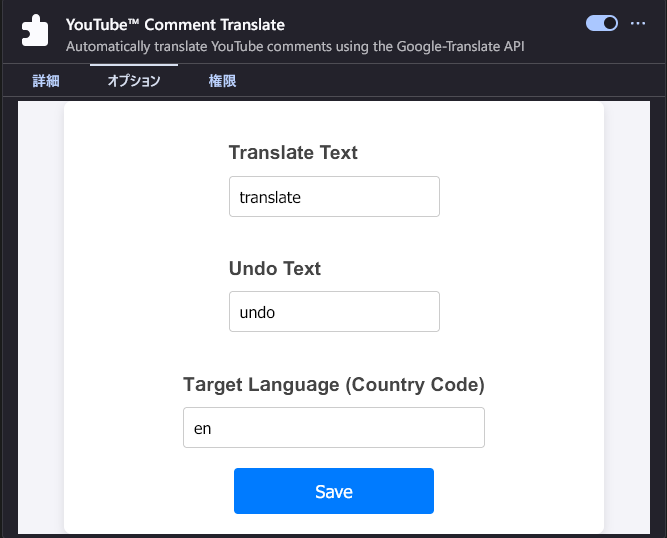

<h1 align="center">YouTube-Comment-Translate (Added Firefox support)</h1>

This is a Firefox port of toluschr/YouTube-Comment-Translate.

* [Usage](#usage)
    * [Changing the language](#changing-the-language)

## Usage

Reload any open YouTube page after installation. A translate button will then appear in the header of every comment.  

### Changing the language

By default, the extension translates to english (en).
You can change both the text and the target language in the settings.

A list of supported languages can be found here: <https://www.gnu.org/software/gettext/manual/html_node/Usual-Language-Codes.html>

The icons used in the README are from the open-source [papirus-icon-theme](https://github.com/PapirusDevelopmentTeam/papirus-icon-theme) project
